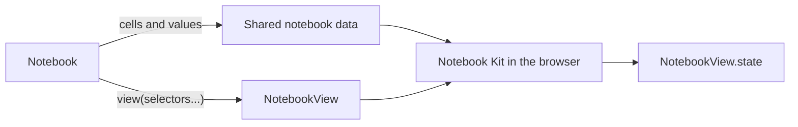

# How pyobservablejs works

`Notebook` holds cells and values. `NotebookCell` points to one cell in that
notebook. `NotebookView` renders all or selected cells in the browser.

| Object         | Contract                                                                                   |
| -------------- | ------------------------------------------------------------------------------------------ |
| `Notebook`     | Holds cells or imported source, files, theme, Python variables, and shared browser inputs. |
| `NotebookCell` | Points to a cell by `key`. Its `index` and `id` are metadata.                              |
| `NotebookView` | Renders selected cells and reports one read-only `state` snapshot.                         |

Authored helpers such as `obs.js(..., key="chart")` return immutable `Cell`
objects. The `key` becomes the portable public identity after the cell enters a
notebook.

```python
import observablejs as obs

readout = obs.js(
    'html`<p>Doubled: <strong>${doubled}</strong></p>`',
    key="readout",
)

notebook = obs.Notebook(
    obs.js("const doubled = base * 2;", key="doubled", display=False),
    readout,
    variables={"base": 21},
)

full_view = notebook.view()
readout_view = notebook.view(readout)
same_view = notebook.view(notebook.cell("readout"))
```

## Python defines, the browser runs

Python sends the notebook and its values to the browser. Notebook Kit runs the
cells there. Each view sends structured results back to Python.



`Notebook.state` is a separate, read-only snapshot of variables, files, and
theme. Frameworks that listen to traitlets can observe it:

```python
def on_state(change):
    print(change["new"].variables)

notebook.observe(on_state, names="state")
notebook.update_variables({"base": 30})
```

`NotebookView.state` reports progress, cell results, errors, and the dependency
graph. Read results after `settled_revision` catches up with `input_revision`.

## One browser run per view

Views from one notebook receive the same Python variables and supported
`viewof` input values. Each keeps its own rendered output, progress, results,
errors, and graph. Select related outputs in one call when they should run
together:

```python
dashboard = notebook.view("doubled", "readout")
```

Selected cells render in notebook order. Cells they need also run, with their
output hidden.

Continue with [Display a notebook](display/notebooks.mdx), [Select
cells](display/cells.mdx), and [Send Python values](connect/python-values.mdx).
