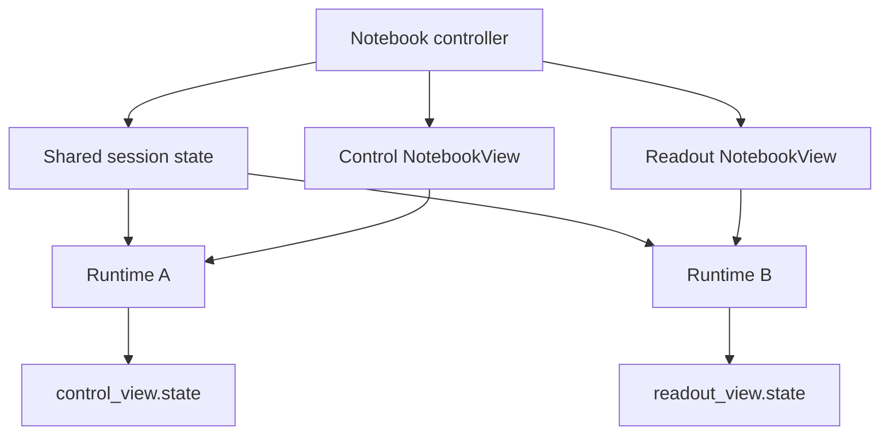

# Widget composition

Create several `NotebookView` objects from one `Notebook` when outputs belong
in different host locations. Values stay synchronized, while each view keeps
its own browser results.

```python
import marimo as mo
import observablejs as obs

control = obs.js(
    """
    const threshold = view(Inputs.range(
      [0, 1],
      {label: "Threshold", step: 0.05, value: 0.5}
    ));
    """,
    key="threshold_control",
)

readout = obs.js(
    'html`<p>Threshold: <strong>${threshold}</strong></p>`',
    key="threshold_readout",
)

notebook = obs.Notebook(control, readout)
control_view = notebook.view(control)
readout_view = notebook.view("threshold_readout")

mo.hstack(
    [
        control_view,
        readout_view,
    ]
)
```

The readout needs `threshold`, so it also runs the control cell and hides that
cell's output. Moving the visible input shares the new value with the readout,
which then runs again.

## What is shared



The notebook shares its cells, theme, files, Python variables, and browser input
values. Each view keeps its own selected cells, rendered output, state, and
lifecycle.

```python
notebook.update_variables({"threshold": 0.8})

control_state = control_view.state
readout_state = readout_view.state
```

The two views may finish at different times. Read or observe each state
separately.

A view can appear in one live location. Create another view for a second
location. Closing one view leaves the others active.

Contributor-facing model references, private traits, revision transport, and
teardown ordering live in the repository's [view composition development
guide](https://github.com/peter-gy/pyobservablejs/blob/main/development_docs/view-composition.md).
