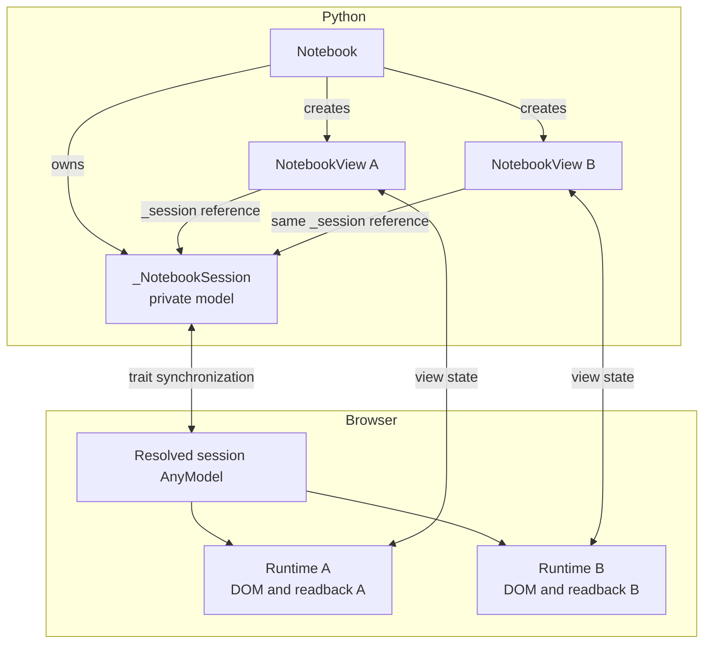

# How views share a notebook session

Views created from one `Notebook` share the notebook definition, Python
variables, and named browser input values. Each `NotebookView` still owns its
browser runtime, DOM output, selection, and readback.

`pyobservablejs` implements this split with
[anywidget](https://anywidget.dev/) widget composition. This page traces that
mechanism for readers building host integrations, debugging cross-view
synchronization, or working on view lifecycle behavior.

## Start with two connected views

The `control_view` and `readout_view` are separate anywidgets backed by the
same `Notebook`:

```python
import marimo as mo
import observablejs as obs

notebook = obs.Notebook(
    obs.js(
        """
        const threshold = view(Inputs.range(
          [0, 1],
          {label: "Threshold", step: 0.05, value: 0.5}
        ));
        """,
        key="threshold_control",
    ),
    obs.js(
        'html`<p>Threshold: <strong>${threshold}</strong></p>`',
        key="threshold_readout",
    ),
)

control_view = notebook.cell("threshold_control").view()
readout_view = notebook.cell("threshold_readout").view()

mo.hstack(
    [
        mo.ui.anywidget(control_view),
        mo.ui.anywidget(readout_view),
    ]
)
```

`control_view` renders the input. `readout_view` evaluates that input as a
hidden dependency in its own runtime, then renders the readout. Moving the
visible input publishes `threshold` to the notebook session. The second
runtime receives the value and recomputes its readout.

## The model graph

`Notebook` is a plain Python controller. It owns one private
`_NotebookSession` anywidget model and creates a new public `NotebookView`
anywidget for each output placement.



The session carries notebook-wide state. Each view carries the state derived
by its own browser runtime.

## What anywidget composition provides

[Anywidget 0.11 introduced widget
composition](https://anywidget.dev/en/afm/#widget-composition), which lets one
widget store a reference to another widget model in synchronized state.
`pyobservablejs` requires anywidget 0.11 or newer for this contract. Python
serializes the referenced widget as a string with this shape:

```text
anywidget:<model_id>
```

The browser receives the reference through the parent model. Anywidget gives
the parent's `render` function two ways to resolve it:

| API                   | Resolved contract                                                                 |
| --------------------- | --------------------------------------------------------------------------------- |
| `host.getWidget(ref)` | The child widget's exports and a function that mounts its view into a DOM element |
| `host.getModel(ref)`  | The child `AnyModel` for direct state access, events, messages, and saves          |

`pyobservablejs` places one widget reference in the `NotebookView._session`
trait and resolves it with `host.getModel`. The private session acts as a
model shared by several view runtimes. The frontend reads its state and
events, while each `NotebookView` mounts its own Notebook Kit DOM.

Anywidget also passes an `AbortSignal` to each render. `pyobservablejs` uses
that signal to bind model subscriptions and runtime cleanup to the lifetime
of the mounted `NotebookView`.

## From a Python object to a browser model

The reference crosses the Python and browser boundary in four steps:

1. `Notebook` constructs one `_NotebookSession`, which has its own anywidget
   model ID and synchronized traits.
2. `Notebook.view()` creates a `NotebookView` whose `_session` trait points to
   that Python session object.
3. Traitlets validates that `_session` is the private session type, and the
   view keeps it tied to its owning `Notebook`. Anywidget's widget-reference
   serializer writes the model ID into the view's wire state.
4. The view frontend calls `host.getModel(ref)`, verifies that the resolved
   model is a notebook session, and opens one Notebook Kit runtime from its
   definition.

A focused view has wire state shaped like this:

```json
{
  "_session": "anywidget:<session-model-id>",
  "_cell_indexes": [1]
}
```

The `_session` string carries identity. The notebook definition and mutable
session traits travel through the session model's own synchronization channel.
Several `NotebookView` models can therefore resolve the same browser model
while keeping separate selections and readback.

## State ownership

| Owner                       | State                                                                                               |
| --------------------------- | --------------------------------------------------------------------------------------------------- |
| `Notebook` session          | Source or cell specification, runtime profile, theme, attachments, Python variables, named inputs |
| `NotebookView` model        | Cell selection and revisioned graph, render, and cell-value readback                                |
| `NotebookView` browser view | Notebook Kit runtime, rendered DOM, observers, and pending evaluation                               |

This ownership produces three distinct synchronization paths.

### Python variables fan out

`notebook.update_variables(...)` updates the session model. Every mounted
view listens to that model and applies the update to its own runtime. A
focused chart and a focused table therefore recompute independently from one
Python call.

### Browser inputs cross between views

A user interaction with a named `viewof` input writes its serializable value
to the session's input-value mapping. Sibling runtimes observe that mapping
and apply the value to their matching input targets. Programmatic writes still
dispatch Observable input events, so dependent cells recompute inside each
runtime.

`Notebook.variables` continues to represent values owned by Python. Browser
interaction values follow the input synchronization path. A view that selects
the input's owning cell can expose its evaluated value through readback.

### Readback stays with its view

Each runtime writes its rendered flag, selected-cell values, and dependency
graph to its own `NotebookView`. Each snapshot stays on its originating view
model. As a result, `control_view.values` and `readout_view.values` can
synchronize at different times and contain different selected-cell records.

## Runtime and teardown

Each mounted `NotebookView` creates one Observable runtime for its selected
cells and their hidden dependency closure, even when several views resolve
the same session model.

One view model owns one live writable output. Create another view with
`notebook.view(...)` or `notebook.cell(...).view()` when the same selection
must appear in two places at once.

The anywidget render signal and a per-attempt abort controller define cleanup:

1. A view mount resolves the session, subscribes to its traits, and starts a
   runtime.
2. A selection or definition change aborts the current attempt before the
   view resolves the session again.
3. Unmounting or `NotebookView.close()` removes listeners and disposes that
   view's runtime.
4. `Notebook.close()` closes every tracked view, then closes the private
   session model.

## Keep the view concepts separate

| Term                              | Meaning                                                                                  |
| --------------------------------- | ---------------------------------------------------------------------------------------- |
| Anywidget widget composition      | A widget reference resolved through `host.getWidget` or `host.getModel`                 |
| `Notebook.view(cells=[...])`      | Several selected Observable cells evaluated in one `NotebookView` runtime               |
| Observable `view(input)`          | A browser input whose current value becomes a reactive Observable variable              |
| `mo.ui.anywidget(notebook_view)`  | A marimo host wrapper that mounts one existing `NotebookView` and observes its readback  |

Continue with [Display a NotebookView](display-views.mdx) for host-specific
mounting, [Bidirectional inputs](../connect/bidirectional-inputs.mdx) for the
shared input contract, and [Manage view lifecycle](view-lifecycle.mdx) for
render gates and closing behavior.
