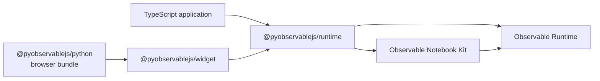

# Architecture

`@pyobservablejs/runtime` mounts notebook source into a browser element.
`@pyobservablejs/widget` connects that mount to Python through
[anywidget](https://anywidget.dev/), the browser component protocol used by
marimo and Jupyter. Python owns authoring, imports, controller lifecycle, and
validation of the synchronized state.

The same runtime powers the widget and the
[standalone TypeScript API](../packages/runtime/README.md). Dependency arrows
point from each consumer to the package it imports:

[Notebook Kit](https://github.com/observablehq/notebook-kit) supplies the
notebook format, cell transpilation, display observers, and standard library.
[Observable Runtime](https://github.com/observablehq/runtime) evaluates the
reactive dependency graph. The runtime package composes these into an isolated
mount with selection, native values, DOM, styles, and disposal.

## Browser runtime

`mountNotebook(element, source, options)` accepts Notebook Kit HTML or a
`NotebookSpec`. Each call owns one Observable runtime and one DOM lifecycle.
It normalizes and analyzes the notebook, includes the selected cells and their
dependencies, installs styles in the owning document or shadow root, and starts
evaluation.

Injected variables are native JavaScript values. Functions, dates, collections,
promises, and DOM objects retain their identities. Variable patches update the
live runtime. Replacement rebuilds evaluation so released names return to their
authored definitions. Source analysis and selection remain fixed for the mount.

`MountedNotebook.state` and `onState` expose evaluation revisions, pending state,
cell results, errors, and the dependency graph. Snapshot records and graph
collections are read-only. Values inside results retain caller-owned native
identities. Each mount tracks attempts and observer generations to reject stale
callbacks. These guarantees also apply to a standalone TypeScript consumer.

Named `viewof` inputs publish native values through `onInput`. `setInputs`
applies values to controls and recomputes their dependents. The runtime marks
programmatic events so they do not become another interaction callback.

The root entry point exposes the mount and its contract types.
`@pyobservablejs/runtime/values` provides native value classification and
comparison for adapters. Python value tags and serialization belong to the
widget package.

## Inspection and data access

`@pyobservablejs/runtime/inspect` is the built Node entry point for static
inspection. It reuses the same Notebook Kit analysis as mounting and returns
source, imports, attachment references, and graph metadata. Notebook
specifications can be inspected in Node. HTML parsing requires a host-provided
DOM parser.

Each mount retains a native value inventory for its evaluated cells. Named,
anonymous, and hidden dependency values have independent revisions. This
inventory powers dataset discovery and explicit reads, independently of preview
capture. Reading a value preserves native identity by default. Dataset
projection and Arrow encoding belong to `datasets.ts` and `arrow.ts`.

The widget's `requests.ts` binds these operations to core anywidget custom
messages for full reads. Static inspection and current dataset descriptors use
separate synchronized traits, so source is sent once per render and catalog
updates carry metadata. Python exposes readonly `inspection` and `datasets`
traits independently of preview capture. The read channel routes generations
and cancellations and sends Arrow IPC as binary buffers. Python `_requests.py`
owns pending reads and timeouts and observes the synchronized generation.
`_inspection.py` owns immutable inspection and data result types. Python
validates and decodes these contracts and retains canonical cell handles.

An explicit read either returns the requested representation or fails.
Reactive preview serialization retains its separate size budget. Original
Observable records remain available through `Notebook.source_document`, while
prepared source and compiled metadata describe the executed notebook.

## Widget adapter

The widget resolves the session referenced by its view model, validates traits,
decodes Python values, and calls `mountNotebook`. Model changes either invoke a
mount method or replace the mount when its source, selection, theme, attachments,
or runtime options change.

`widget/src/values.ts` owns the Python wire codec. `ReadbackPublisher` serializes
native runtime results, converts graph field names to the wire shape, and
publishes one revisioned `_readback` mapping. It owns transport revisions and
generation guards across remounts. Serialization failures become cell errors at
this boundary.

Shared named inputs travel through the session's `_view_values` trait. The
adapter publishes values that can round-trip through the codec and applies
received values with `setInputs`. Other interaction values remain local to
their mount. Readback stays on the originating view model, keeping marimo
reactivity scoped to that view.

See [View composition](view-composition.md) for the model, selection,
synchronization, and teardown paths.

## Python controller and views

`Notebook` is the public [traitlets](https://traitlets.readthedocs.io/)
controller. Traitlets provides validated attributes and change notifications.
The controller owns the prepared definition, canonical cell handles, variables,
attachment records, theme, and detached `NotebookState`.

`_NotebookSession` is its private anywidget transport model. It carries the
definition and controller values to each view. `NotebookView` is the renderable
model and owns a detached Python `ViewState` populated from its browser mount.

`Notebook.view(*selectors)` resolves key strings, keyed authored cells, or
same-owner `NotebookCell` handles. Each call creates an independent view model
and mount. A composite selection evaluates its cells together. Closing one
view leaves sibling views and the controller alive. Closing the controller
closes every tracked view and its private session. The standalone Python
`view_from_*` factories make their returned view own the temporary controller.

Python accepts a strictly newer transport revision, validates the complete wire
shape, and replaces `NotebookView.state` once. `capture_state=False` keeps the
initial Python state while rendering and input synchronization continue.

## Source imports and runtime profiles

Python `from_html` retains Notebook Kit HTML. Optional attachment embedding
registers local files as data URL records. Optional import rewriting embeds
local JavaScript modules before the source reaches the browser.

`from_observablehq` converts public notebook documents to Notebook Kit HTML.
The document id and version form an import resolution token, preserving the
dependency revisions chosen by that notebook. A document mapping with neither
field retains its supplied import specifiers. Python lowers table operations
to classic `__query` calls. SQL source remains in SQL cells, which the runtime
compiles with Notebook Kit's template parser and classic `__query.sql` for
row arrays and query invalidation.

`NotebookModel.runtime_profile` selects evaluation behavior and the standard library:

- `notebook-kit` uses `@observablehq/notebook-kit/runtime` builtins and is the
  default for authored notebooks and HTML with no profile metadata.
- `observable` includes the classic `@observablehq/stdlib` library and is
  selected by ObservableHQ constructors.

Notebook Kit's public `transpile`, `NotebookRuntime.define`, and `observe`
APIs own compilation, variable definitions, and output inspection. Observable
Runtime resolves asynchronous dependencies, supplies `invalidation`, advances
generators, and disposes their resources. The mount tracks selection, native
values, and host input ownership around those APIs.

The private `_runtime_profile` trait becomes the mount's `runtimeProfile`
option. The runtime adds scoped document helpers, `width`, `dark`, attachments,
and injected variables to the selected library. Python HTML serialization
stores the profile in `data-pyobservablejs-runtime-profile` and restores it on
import. Direct TypeScript callers choose the profile through mount options.

## Error propagation

The runtime's `diagnostics.ts` owns safe exception detail extraction and current
cell/runtime diagnostics. The widget publishes `_diagnostics` independently of
preview capture, with monotonic revision and the applied Python update sequence.
The Python `errors` namespace owns immutable diagnostic records and exception
formatting. `NotebookView.raise_for_errors()` raises the current report.

`NotebookView.ready()` uses the correlated request channel. The widget waits for
the requested Python sequence, awaits native `MountedNotebook.ready()`, and
replies with complete readback and diagnostics. Python accepts both through
the normal inbound state path before returning or raising. This checkpoint is
independent of ipywidgets trait throttling. Fatal diagnostics reject
pending operations. An accepted empty report clears previous failures.
