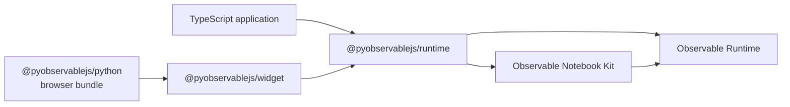

# Architecture

`@pyobservablejs/runtime` mounts notebook source into a browser element.
`@pyobservablejs/widget` connects that mount to Python through
[anywidget](https://anywidget.dev/), the browser component protocol used by
marimo and Jupyter. Python owns authoring, source acquisition, controller
lifecycle, and validation of synchronized state. The runtime owns source interpretation,
compilation, module resolution, evaluation, and browser resources.

The same runtime powers the widget and the
[standalone TypeScript API](../packages/runtime/README.md). Dependency arrows
point from each consumer to the package it imports:

[Notebook Kit](https://github.com/observablehq/notebook-kit) supplies the
notebook format, cell transpilation, display observers, and standard library.
[Observable Runtime](https://github.com/observablehq/runtime) evaluates the
reactive dependency graph. The runtime package composes these into an isolated
mount with selection, native values, DOM, styles, and disposal.

## Browser runtime

`mountNotebook(element, source, options)` accepts Notebook Kit HTML or a
`NotebookSpec`. Each call owns one Observable runtime and one DOM lifecycle.
It normalizes and analyzes the notebook, includes the selected cells and their
dependencies, installs styles in the owning document or shadow root, and starts
evaluation.

Injected variables are native JavaScript values. Functions, dates, collections,
promises, and DOM objects retain their identities. Variable patches update the
live runtime. Replacement rebuilds evaluation so released names return to their
authored definitions. Source analysis and selection remain fixed for the mount.

`MountedNotebook.state` and `onState` expose evaluation revisions, pending state,
cell results, errors, and the dependency graph. Snapshot records and graph
collections are read-only. Values inside results retain caller-owned native
identities. Each mount tracks attempts and observer generations to reject stale
callbacks. These guarantees also apply to a standalone TypeScript consumer.

Named `viewof` inputs publish native values through `onInput`. `setInputs`
applies values to controls and recomputes their dependents. The runtime marks
programmatic events so they do not become another interaction callback.

The root entry point exposes the mount and its contract types.
`@pyobservablejs/runtime/values` provides native value classification and
comparison for adapters. Python value tags and serialization belong to the
protocol package.

## Inspection and data access

`@pyobservablejs/runtime/inspect` is the built Node entry point for static
inspection. It reuses the same Notebook Kit analysis as mounting and returns
source, imports, attachment references, and graph metadata. Notebook
specifications can be inspected in Node. HTML parsing requires a host-provided
DOM parser.

Each mount retains a native value inventory for its evaluated cells. Named,
anonymous, and hidden dependency values have independent revisions. This
inventory powers dataset discovery and explicit reads, independently of preview
capture. Pending reads subscribe to their selected value; discovery waits on a
shared pending count instead of registering one reader per value. Reset and
input epochs invalidate outstanding reads. Cell and name indexes keep lookup,
invalidation, and failure settlement local to the matching values. Reading a value preserves native identity by default. Dataset
projection and Arrow encoding belong to `datasets.ts` and `arrow.ts`. Row-backed
Arrow exports capture projected columns directly before loading Arrow, avoiding
an intermediate array of reconstructed row objects. Known column projections
do not enumerate unrelated columns across the entire dataset.
Row reads from native Arrow tables acquire each column vector once per read,
including across record-batch boundaries. Stored row properties are read directly
from their descriptors; only Arrow row proxies need protocol-based property access.

The widget's `requests.ts` binds these operations to core anywidget custom
messages for full reads. Static inspection and current dataset descriptors use
separate synchronized traits, so source is sent once per render and catalog
updates carry metadata. Python exposes readonly `inspection` and `datasets`
traits independently of preview capture. The read channel routes generations
and cancellations and sends Arrow IPC as binary buffers. Python `_requests.py`
owns pending reads and timeouts and observes the synchronized generation.
`_inspection.py` owns immutable inspection and data result types. Python
validates and decodes these contracts and retains canonical cell handles.

An explicit read either returns the requested representation or fails.
Reactive preview serialization retains its separate size budget. Original
Observable records remain available through `Notebook.source_document`, while
prepared source and compiled metadata describe the executed notebook.

## Widget adapter

The widget resolves the session referenced by its view model, validates traits,
decodes Python values, and calls `mountNotebook`. Model changes either invoke a
mount method or replace the mount when its source, selection, theme, attachments,
or runtime options change.

`protocol/src/values.ts` owns the Python wire codec shared by widget and server. `ReadbackPublisher` serializes
native runtime results, converts graph field names to the wire shape, and
publishes one revisioned `_readback` mapping. It owns transport revisions and
generation guards across remounts. Serialization failures become cell errors at
this boundary.

Shared named inputs travel through the session's `_view_values` trait. The
adapter publishes values that can round-trip through the codec and applies
received values with `setInputs`. Other interaction values remain local to
their mount. Readback stays on the originating view model, keeping marimo
reactivity scoped to that view.

See [View composition](view-composition.md) for the model, selection,
synchronization, and teardown paths.

## Python controller and views

`Notebook` is the public [traitlets](https://traitlets.readthedocs.io/)
controller. Traitlets provides validated attributes and change notifications.
The controller owns the prepared definition, canonical cell handles, variables,
attachment records, theme, and detached `NotebookState`.

`_NotebookSession` is its private anywidget transport model. It carries the
definition and controller values to each view. `NotebookView` is the renderable
model and owns a detached Python `ViewState` populated from its browser mount.

`Notebook.view(*selectors)` resolves key strings, keyed authored cells, or
same-owner `NotebookCell` handles. Each call creates an independent view model
and mount. A composite selection evaluates its cells together. Closing one
view leaves sibling views and the controller alive. Closing the controller
closes every tracked view and its private session. The standalone Python
`view_from_*` factories make their returned view own the temporary controller.

Python accepts a strictly newer transport revision, validates the complete wire
shape, and replaces `NotebookView.state` once. `capture_state=False` keeps the
initial Python state while rendering and input synchronization continue.

## Source imports and runtime profiles

The source path has one owner for each transition:

| Transition                                                          | Owner                                              |
| ------------------------------------------------------------------- | -------------------------------------------------- |
| Fetch a public page and decode its data records                     | Python Observable adapter                          |
| Convert classic nodes or native cells into Notebook Kit HTML        | Python `_observable_model.py` adapter              |
| Read profile, source identity, and dependency resolutions from HTML | Runtime `source.ts`                                |
| Parse and compile cell languages                                    | Observable Notebook Kit through runtime `graph.ts` |
| Lower notebook imports in modern JavaScript or TypeScript cells     | Runtime `notebook-imports.ts`                      |
| Resolve revisions, cache source, and define native modules          | Runtime `modules.ts` and `module-definition.ts`    |
| Request dependency source over the widget comm                      | Widget `imports.ts` and Python `_imports.py`       |

Python performs the first two transitions before a browser exists because the
public controller exposes canonical cell handles synchronously and retains the
original source document. The adapter produces Notebook Kit HTML and does not
compile or evaluate JavaScript. The same runtime module loader is available to
standalone TypeScript callers through `resolveNotebook`.

Python `from_html` retains Notebook Kit HTML. Optional attachment embedding
registers local files as data URL records. Optional import rewriting embeds
local JavaScript modules before the source reaches the browser.

`from_observablehq` fetches the original model embedded in the public notebook
page. `_observable_fetch.py` decodes the page's data records without executing
scripts. It preserves explicit cell languages and verifies requested revisions.
The controller model distinguishes classic `nodes` from native `cells` or
`body.cells`. `_observable_legacy.py` lowers classic table, chart, SQL, and code
nodes. Classic `js` becomes `ojs`. Native modes remain unchanged. Library
version is independent of source shape: `stdlib: "1"` selects `observable`,
and `"2"` selects `notebook-kit`. Missing declarations default to the source
format's library.

Python lowers classic table and chart records to Notebook Kit cells. SQL source
retains the classic query semantics when the source selects the classic library.
HTML exports retain the runtime profile and the source origin, including declared
notebook resolutions.

The browser uses Notebook Kit's parsers and compiler for imported source too.
The widget requests dependency models over the private session's correlated
`observablejs:import` channel. Python caches fetched source per session. The
runtime caches module definitions per resolved identity and resolution scope,
then uses native Runtime modules, imports, and derivation. Notebook Kit's public
`resolveImport` option maps notebook imports to the runtime's private module
protocol before compilation, so evaluation does not depend on the compiled
JavaScript export endpoint. Dependency modules
have separate libraries and attachment registries and share the view's Runtime
lifecycle. Runtime disposal owns all cell variables, including derived modules;
the source loader releases attachment registries after runtime invalidation.
Their cells remain lazy. Literal notebook imports require a source
resolver for standalone TypeScript mounts.

Modern cells containing notebook imports lower the bindings into private input
variables before compilation, allowing calculations in the same cell to react
to imported values. Inspection retains the authored source and public bindings.

Notebook Kit's public `transpile`, `NotebookRuntime.define`, and `observe`
APIs own compilation, variable definitions, and output inspection. Observable
Runtime resolves asynchronous dependencies, supplies `invalidation`, advances
generators, and disposes their resources. The mount tracks selection, native
values, and host input ownership around those APIs.

The notebook source is the wire authority for its runtime profile and origin.
Python HTML serialization stores them in
`data-pyobservablejs-runtime-profile` and `data-pyobservablejs-origin`.
The widget forwards source without parallel profile or origin traits. The
runtime parses those attributes before analysis and adds scoped document
helpers, `width`, `dark`, attachments, and injected variables to the selected
library. Direct TypeScript callers using `NotebookSpec` choose the profile and
origin through mount options.

## Error propagation

The runtime's `diagnostics.ts` owns safe exception detail extraction and current
cell/runtime diagnostics. The widget publishes `_diagnostics` independently of
preview capture, with monotonic revision and the applied Python update sequence.
The Python `errors` namespace owns immutable diagnostic records and exception
formatting. `NotebookView.raise_for_errors()` raises the current report.

`NotebookView.ready()` uses the correlated request channel. The widget waits for
the requested Python sequence, awaits native `MountedNotebook.ready()`, and
replies with complete readback and diagnostics. Python accepts both through
the normal inbound state path before returning or raising. This checkpoint is
independent of ipywidgets trait throttling. Fatal diagnostics reject
pending operations. An accepted empty report clears previous failures.

## Headless execution

`@pyobservablejs/runtime/headless` exposes `evaluateNotebook`. It shares source
normalization, Notebook Kit compilation and definitions, dependency selection,
attachment scope, native value inventory, readiness, and diagnostics with browser
mounts. A non-rendering observer replaces Notebook Kit's display inspector. The
host supplies a DOM document. Neither a mounted view nor anywidget participates.
`cell-evaluation.ts` owns named-value observers and cell diagnostic attribution
for both hosts; display and input observers remain in their respective hosts.

`@pyobservablejs/protocol` owns Python value encoding and read request validation.
The widget and `@pyobservablejs/server` import it. Dependencies point from either
adapter toward the protocol and runtime packages. The runtime never imports an
adapter or Python wire types.

The server adapter creates a Happy DOM realm, then loads Notebook Kit. It bundles
its dependencies into the Python wheel and uses Deno's native module loader for
notebook imports. Classic package references use native ESM module entries.
Browser DOM resource loading and navigation are disabled. See
[the server adapter](../packages/server/README.md) for process framing.

Python `_controller.py` owns transport-independent definition and variable state.
`_widget_session.py` creates the anywidget transport on the first `view()` call
and mirrors coherent controller snapshots. `_view.py` owns the renderable widget
and its correlated read and state-publication boundaries. `_execution.py` owns a
private process resource with one immutable snapshot. It applies current controller
bindings before preparing synchronous or asynchronous reads, including validation
of discovered dataset generations. Headless I/O never runs inside controller observers. Public data, file,
cell, and graph namespaces delegate to that backend or to the originating
anywidget view. Core imports never require Deno. `_server_process.py` owns
Deno discovery, framed I/O, pending requests, bounded stderr capture, and process
termination. Python metadata and state decoding are shared with browser views.
Static inspection is transferred at startup. Subsequent checkpoints carry
monotonically revisioned state, dataset metadata, and diagnostics.

The Chromium engine runs the same command service in an actual browser through
Playwright hosted by Deno. It calls `mountNotebook` directly, without a widget.
Deno serves browser modules through a virtual origin intercepted by Playwright,
and relays framed responses to Python. Binary bytes cross this boundary without
conversion into Python JSON arrays. The engine is explicit and fixed per server.
The protocol package also owns shared cell readback encoding and graph wire
mapping, while adapters own publication revisions and delivery.

## Data namespaces

`_data.py` owns synchronous headless references. `_async_data.py` owns awaitable
view references and async headless access. Both use `_data_types.py` descriptions,
static provenance, and discovery catalogs. `_file_access.py` owns file references
and `_conversions.py` owns optional dataframe decoders. `_namespaces.py` owns cell
collections, dependency traversal, and rendering. Every dataframe converter
returns the target library's native object. The notebook and its canonical cell
namespaces share an execution pool. Reads reuse an existing enclosing selection;
discovery keeps its exact catalog scope. Distinct selections remain independent
when no enclosing evaluation exists, preserving lazy evaluation of unrelated cells.
`using(...)` creates an independent execution configuration. `_evaluation_pool.py`
owns startup and cancellation before handing an open evaluation to a caller.

The TypeScript protocol owns selection parsing, automatic Python-value read
representation, exact read encoding, and metadata-only descriptions. Runtime
value inventory settlement powers discovery independently of preview capture.
Exact reads validate and encode values in one traversal with an explicit budget.
Preview summarization is a separate contract and does not participate in full reads.
Anywidget requests and Deno commands use these same contracts. Public namespace
methods hide wire records and transport revisions while retaining snapshot-safe
discovery references.
