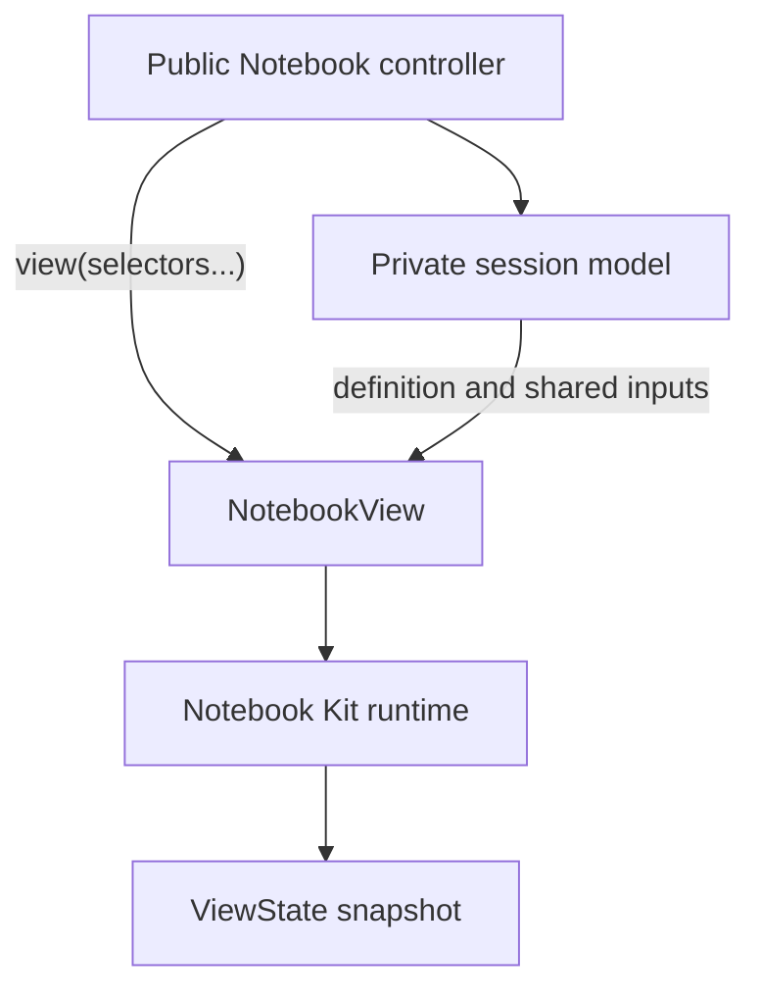

# Architecture

`pyobservablejs` is browser-first. Python owns notebook definitions,
serialization, attachments, and session state. The browser evaluates
Observable JavaScript through Notebook Kit. A `NotebookView` owns each browser
runtime and its synchronized readback.

The installed wheel includes the browser runtime used by anywidget hosts such
as marimo and Jupyter.

See [View composition](view-composition.md) for the selection, model-resolution,
synchronization, readback, and teardown paths behind `NotebookView`.

## Ownership boundaries

`Notebook` is a traitlets controller. It owns the definition, canonical cell
handles, immutable controller state, and lifecycle. Its private anywidget
session model carries the definition and shareable named browser input values
to each view.

`NotebookCell` is the stable handle for one cell. Its public key selects the
cell. Its id and index are serialization and notebook-order metadata.

`NotebookView` is the public renderable anywidget. It owns one Notebook Kit
runtime and immutable `ViewState`. `Notebook.view()` selects every cell.
`Notebook.view(*selectors)` creates a focused or composite selection that
evaluates in one runtime. Selectors are key strings, keyed authored cells, or
same-owner cell handles.

Standalone `view_from_*` factories return a view that owns its temporary
notebook. Closing that view closes the private session and its live views.

Separate views from one notebook share named Python variables. A browser input
event on a named `viewof` value becomes session state for current and future
views when the serialized value is writable across runtimes. Untouched source
defaults and unsupported interaction values remain local to each runtime. Use a
composite view when multiple cells require the same runtime and graph snapshot.

## Render lifecycle

1. Python creates a `Notebook` from authored cells, Notebook Kit HTML, or an
   ObservableHQ document.
2. Python creates a `NotebookView` with a full, single-cell, or composite
   selection.
3. `Notebook.view()` adapts the view to a marimo UI element when it runs in a
   marimo notebook. Other anywidget hosts receive the `NotebookView` directly.
4. The frontend resolves the private session model referenced by the view and
   reads its definition, runtime profile, attachments, variables, renderer
   options, and shared input values.
5. Notebook Kit parses or transpiles the definition. The runtime profile
   selects the standard library before creating one Observable runtime for that
   view.
6. The browser writes input and settled revisions, pending state, structured
   results, errors, and graph metadata to the view model.
7. Teardown disposes the runtime, model listeners, and DOM owned by that view.

Creating another view repeats steps 2 through 7 with a distinct model and
runtime. Closing one view leaves the notebook session and sibling views alive.

## Session synchronization

Python variable methods mutate the notebook session. `update_variables` sends
changed values and cleared interacted-input names to each active view.
`replace_variables` publishes when the environment changes or interacted input
state clears, then rebuilds each active runtime so released names return to
Notebook Kit ownership.

Browser input events on named `viewof` values publish writable serialized
values to the session. A sibling writes the value to its matching input, then
dispatches Observable `input` and `change` events when the value round-trips
unchanged. A target can coerce the property write before a failed round trip
suppresses those events. Equality checks at the session boundary prevent an
unchanged browser value from becoming another input update.

View readback stays on the originating `NotebookView` model. This keeps marimo
reactivity scoped to the wrapped view and prevents a readback update from
recreating the shared session.

## Readback ownership

Each view owns one immutable `ViewState` snapshot. Python reads revisions,
pending state, structured cell results, view errors, and graph metadata through
`NotebookView.state`.

Each render attempt carries one monotonic token. Each evaluation wave carries
an input revision, and each observer channel carries a generation. Writes from
an aborted or superseded attempt, revision, or generation are dropped. The
settled revision advances when every selected result reaches a terminal state.
The view publishes its graph, results, errors, and revision fields as one wire
snapshot. Python rejects delayed transport revisions and validates the complete
shape before replacing `NotebookView.state` once.

## Source-backed notebooks

`from_html` keeps Notebook Kit HTML as source. When requested,
`embed_file_attachments` registers local attachments as data URL records and
`rewrite_imports` embeds local JavaScript modules in the source before it
reaches the browser.

`from_observablehq` fetches public notebooks and converts document API cells
into Notebook Kit HTML. The document `id` and `version` form an import
resolution token. Observable import cells are rewritten to public v4 module
URLs carrying that token, which preserves the dependency revisions selected by
the source notebook. Document mappings without an id and version keep their
supplied import specifiers.

## Runtime profiles

`NotebookModel.runtime_profile` records the standard library required by the
source:

- `notebook-kit` uses the builtins exported by
  `@observablehq/notebook-kit/runtime`. Python-authored notebooks and Notebook
  Kit HTML without profile metadata select this profile.
- `observable` creates a `Library` from `@observablehq/stdlib`. Every
  ObservableHQ constructor selects this profile.

The notebook session sends the profile through the dedicated
`_runtime_profile` trait. The widget carries it into `RuntimeOptions`, and the
runtime package constructs the selected builtin set before adding the shared
attachment registry, scoped document helpers, `width` and `dark` generators,
and Python variables. The profile is fixed for the notebook session and
inherited by each view. Serialized ObservableHQ source records the profile in
the root `data-pyobservablejs-runtime-profile` attribute. The HTML parser
restores that profile when `from_html` reconstructs the model.
