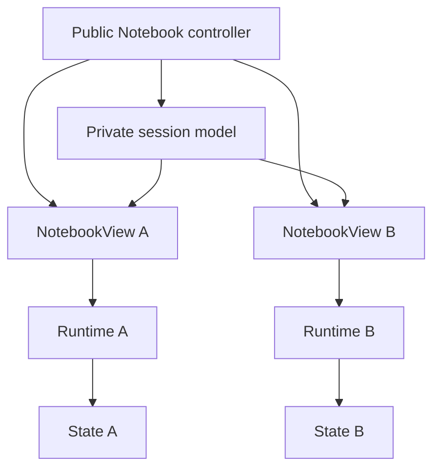

# View composition

One Python `NotebookView` maps to one browser runtime. The `Notebook` controller
owns a private session model that shares definitions and mutable controller
state across views. Each view owns its selection, DOM, state snapshot, and
teardown.

## Component map

| Component                                               | Ownership                                                                                    |
| ------------------------------------------------------- | -------------------------------------------------------------------------------------------- |
| `packages/pyobservablejs/src/observablejs/_notebook.py` | Resolves public selectors, creates views, validates readback, and publishes immutable state. |
| `packages/widget/src/model.ts`                          | Reads session references, selections, definitions, and render options.                       |
| `packages/widget/src/view.ts`                           | Resolves a session model, owns render attempts, analyzes the notebook, and starts a runtime. |
| `packages/widget/src/composition.ts`                    | Expands dependency closures and maps selected or hidden render targets.                      |
| `packages/widget/src/session.ts`                        | Owns the runtime, root DOM, variables, named inputs, and cleanup.                            |
| `packages/widget/src/cell-renderer.ts`                  | Defines cells, attaches observers, and classifies cell failures.                             |
| `packages/widget/src/variable-sync.ts`                  | Applies Python variables, shares browser inputs, and aggregates cell channels.               |
| `packages/widget/src/readback.ts`                       | Publishes revisioned results, errors, pending state, and graph snapshots.                    |

Notebook Kit analysis stays in `packages/runtime`. Anywidget composition,
visibility, model resolution, and readback stay in `packages/widget`.

## Model boundary

`Notebook` is a traitlets controller. Its private `_NotebookSession` anywidget
model carries the definition, runtime profile, attachments, theme, Python
variables, named browser inputs, render options, and cell keys.

`NotebookView` carries an anywidget reference to that session, normalized cell
indexes, and one `_readback` mapping. The frontend resolves the reference with
`host.getModel` and requires `_model_role="session"`.

The `_session` trait uses anywidget's widget-reference serializers. The browser
wire carries `anywidget:<model_id>`. Session data travels through the session
model's own synchronization channel.

## Public selection to browser indexes

`Notebook.view(*selectors)` resolves each key string, keyed authored `Cell`, or
same-owner `NotebookCell` to a canonical handle. It rejects duplicates after
normalization and sorts selected indexes into notebook order. No selectors
means the full notebook.

`_cell_indexes` carries `None` for the full notebook or a nonempty list for an
explicit selection. The widget validates the wire shape again.
`notebookViewIndexes` adds each selected cell's transitive dependencies.

`renderNotebookView` maintains two sets:

- `selectedIndexes` controls visible output and public cell results
- `renderIndexes` includes selected cells and hidden dependencies

Cells are defined in notebook order. Dependency-only wrappers receive `hidden`
and `aria-hidden="true"`.

## Runtime lifecycle

Each render attempt owns an `AbortController` and attempt token:

1. Read the selection and resolve the referenced session.
2. Subscribe to session changes that require a new runtime.
3. Deserialize or construct the notebook and analyze its graph.
4. Resolve selected and dependency indexes.
5. Publish the selected graph for the current attempt.
6. Open a runtime with variables, inputs, attachments, theme, and runtime profile.
7. Mark selected cells pending and define all included cells.
8. Restore shared named inputs and apply Python-owned values.
9. Publish terminal cell results and settle the input revision.

Selection, source, spec, theme, attachments, base URL, runtime profile, options,
or cell keys abort the current attempt and rebuild. Python `set` updates apply
to the live runtime. A variable replacement can release definitions, so it
rebuilds with the new environment.

## Shared inputs

Each runtime registers named `viewof` targets with `RuntimeViewSync`. Browser
input events serialize supported values into the session's `_view_values`
mapping. Sibling runtimes apply the value to matching targets and dispatch
Observable input events.

Programmatic writes are marked in a `WeakSet` while events dispatch. Their
listeners recompute dependent cells while skipping another session
publication. When Python takes ownership of a name, the session clears its
shared browser value before applying the Python value.

## Readback state machine

`_readback` is one mapping with `revision`, `input_revision`,
`settled_revision`, `pending`, `graph`, `results`, and `errors` fields.

`revision` protects anywidget transport ordering. `input_revision` identifies
the current evaluation wave. `settled_revision` remains on the previous wave
while selected cells are pending. Each result carries the input revision, cell
status, synchronized values, and structured errors.

Every observer callback carries the render attempt, input revision, cell index,
channel, and channel generation. A newer input revision or render attempt makes
older callbacks stale. `ViewReadback` ignores them.

Python requires a strictly newer transport revision and validates the complete
wire shape before replacing `NotebookView.state` once. This guard is required
for hosts that transport model saves as independent requests.

## Teardown

Aborting a render removes model, input, and cell listeners and disposes its
Observable runtime. `NotebookView.close()` closes one display model.
`Notebook.close()` closes every tracked view and then the private session model.
Closing a standalone factory view also closes its temporary notebook session.
Late callbacks cannot publish after either abort boundary.
