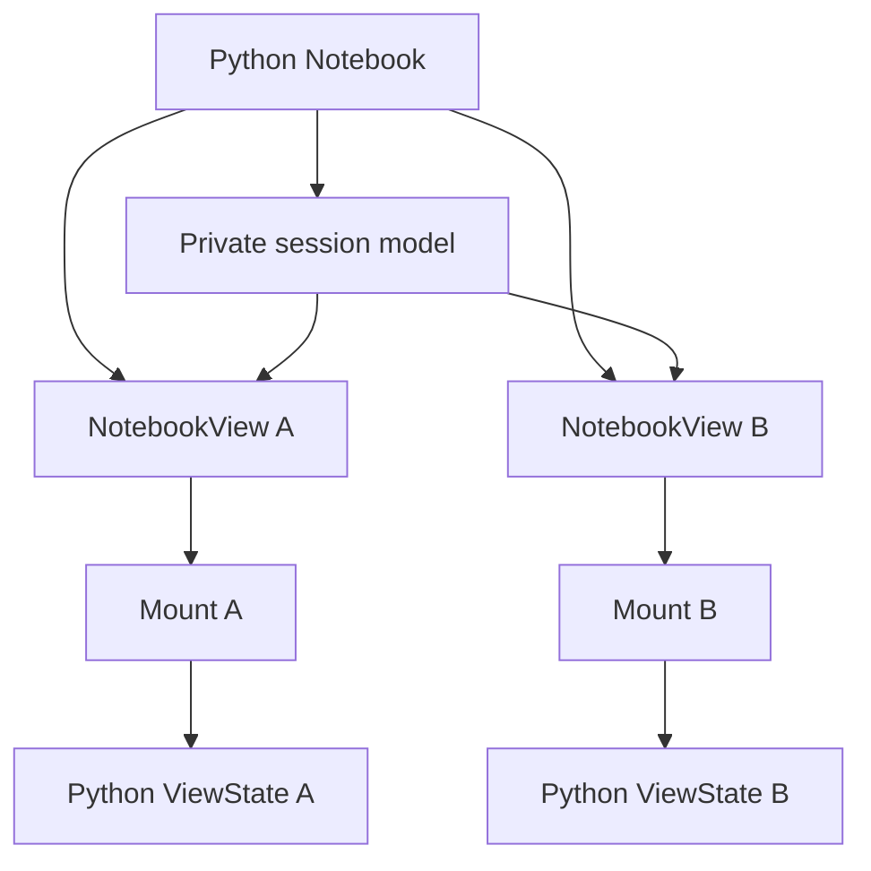

# View composition

One Python `NotebookView` maps to one `mountNotebook` handle. The widget adapter
owns the model connection. The runtime owns the selected cells, DOM, input
controls, evaluation state, and disposal. The `Notebook` controller shares
definitions and controller values through its private session model.

## Component map

Paths are relative to their package's `src/` directory.

| Package and component                                        | Ownership                                                                          |
| ------------------------------------------------------------ | ---------------------------------------------------------------------------------- |
| `pyobservablejs/observablejs/_notebook.py`                   | Resolves public selectors and owns controller and view lifecycle.                  |
| `pyobservablejs/observablejs/_readback.py`                   | Validates wire snapshots and builds detached Python state.                         |
| `widget/model.ts`                                            | Reads session references, selection traits, source, and mount options.             |
| `widget/view.ts`                                             | Resolves models, subscribes to changes, and forwards values to the mount.          |
| `widget/values.ts`                                           | Encodes browser values and decodes Python wire values.                             |
| `widget/readback.ts`                                         | Publishes complete wire snapshots with monotonic transport revisions.              |
| `runtime/mount.ts`                                           | Owns notebook preparation, render attempts, variable methods, and disposal.        |
| `runtime/composition.ts`                                     | Expands dependencies and maps selected and hidden cell targets.                    |
| `runtime/cell-renderer.ts`                                   | Defines cells, attaches observers, and classifies evaluation and rendering errors. |
| `runtime/inputs.ts` and `runtime/view-inputs.ts`             | Apply injected variables and coordinate named controls and interaction events.     |
| `runtime/cell-state.ts` and `runtime/state.ts`               | Aggregate observer channels into native cell results and evaluation snapshots.     |
| `runtime/dom.ts`, `runtime/themes.ts`, and `runtime/styles/` | Render cell containers and source, and install scoped notebook styles.             |

## Model boundary

`_NotebookSession` carries the definition, runtime profile, attachments, theme,
Python variables, named browser inputs, render options, and cell keys.
`NotebookView` carries an anywidget session reference, normalized cell indexes,
the `_capture_state` boolean, and its `_readback` mapping.

The widget resolves `_session` with `host.getModel` and requires
`_model_role="session"`. The wire reference is `anywidget:<model_id>`, using
[anywidget's model-reference protocol](https://anywidget.dev/en/afm/).
Session data travels through the session model's synchronization channel.

## Selection and dependencies

Python resolves each public selector to a canonical cell handle, rejects
duplicates, and sorts selected indexes into notebook order. `_cell_indexes`
carries `None` for the full notebook or a nonempty list for a selection. The
widget validates the trait and forwards it as the mount's `selection` option.

The runtime validates indexes against the parsed notebook and computes each
selected cell's transitive dependencies. `selectedIndexes` controls visible
output and result capture. `renderIndexes` includes the selected cells and
hidden dependencies. The published graph covers `renderIndexes`.

Cells are defined in notebook order. Dependency wrappers receive `hidden` and
`aria-hidden="true"`. Their observers omit Notebook Kit's visibility node so
the hidden dependency can evaluate while a selected cell waits for its value.

## Mount lifecycle

1. The widget resolves the referenced session and subscribes to model changes.
2. It decodes variables and shared inputs, then passes the source and options
   to `mountNotebook`.
3. The runtime normalizes the source, analyzes its graph, and resolves selection.
4. The mount creates its DOM root, installs styles in the document or shadow
   root, and opens a scoped runtime with attachments and injected variables.
5. Selected results become pending, then the runtime defines every included cell.
6. Named controls register interaction listeners, restore input state, and
   receive initial injected values.
7. Runtime observers publish native results. The widget serializes snapshots
   and sends them to Python.

Changes to selection, source, spec, theme, attachments, base URL, runtime profile,
render options, or cell keys replace the mount. Python `set` patches call
`updateVariables`. Replacement calls `replaceVariables`, rebuilding evaluation
with the new injected environment while retaining the mount's prepared source,
selection, and read-only graph in pending and settled snapshots.

## Variables and named inputs

Injected variables take ownership of matching authored names. A patch updates
the live runtime. Replacement releases omitted names to authored evaluation.
Named `viewof` controls receive representable values through their native
properties. A value that the control cannot represent becomes an injected
runtime definition. A later representable value reconnects the control's input
dependency.

The runtime emits `onInput(name, value)` for browser interactions. The widget
encodes the value and publishes supported shared inputs to `_view_values`.
Sibling adapters decode the mapping and call `setInputs`. Programmatic writes
recompute dependent cells while suppressing another interaction callback.

A control can coerce a property write before round-trip validation suppresses
its input events. The widget codec determines which values can be shared across
Python views. Native TypeScript mounts retain native control values.

When Python takes ownership of a name, the adapter clears the session's shared
input before forwarding the variable update. Sequence numbers reject repeated
or delayed `_variable_update` patches.

## Evaluation state and wire publication

The runtime's `EvaluationState` owns render attempts, input revisions, pending
results, and observer channel generations. The settled revision advances after
every pending selected result terminates. A disjoint input change preserves
already-running work. A new attempt or superseding change rejects stale tokens.

Native snapshots expose `inputRevision`, `settledRevision`, `pending`, `graph`,
`results`, and `errors`. Snapshot records and graph collections are read-only.
Unchanged cell records are shared across snapshots. Captured values keep their
native identities and remain owned by their caller.

`ReadbackPublisher` converts each native snapshot into one `_readback` mapping:
`revision`, `input_revision`, `settled_revision`, `pending`, `graph`, `results`,
and `errors`. It translates `runtimeOutputs` to `runtime_outputs`, serializes
values, records serialization errors, and keeps revisions monotonic across
mount replacements. Capture runs synchronously so later mutations cannot alter
a queued wire value. The publisher reuses the converted graph and sends the
latest complete snapshot from a microtask. This batches cell settlements before
anywidget clones changed traits for the comm. Its generation guard rejects
publication from a replaced mount.

Python compares transport revisions and validates the whole mapping before
replacing `NotebookView.state`. The accepted snapshot stays separate from the
incoming trait value because transport can batch assignments before validation.

`_capture_state=False` passes `captureState: false` to the mount and skips wire
publication. Rendering, variables, and named inputs continue independently of
state capture.

## Teardown

The widget aborts its model subscriptions and disposes the mount. Runtime
disposal aborts input and cell listeners, disposes Observable evaluation,
unregisters attachments, revokes owned object URLs, and clears its element.
Late callbacks cannot publish after the abort boundary. Styles installed for
the owning document or shadow root remain available to sibling mounts.

Python `NotebookView.close()` closes one display model. `Notebook.close()`
closes every tracked view and then its private session. A standalone Python
factory view also closes its temporary controller.
