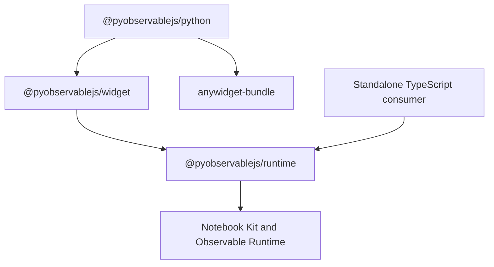

# Workspace

The repository uses [pnpm workspaces](https://pnpm.io/workspaces) for browser
packages and [uv workspaces](https://docs.astral.sh/uv/concepts/projects/workspaces/)
for the Python distribution and contributor environment.

## Package graph



| Package                   | Contract                                                                                                 |
| ------------------------- | -------------------------------------------------------------------------------------------------------- |
| `packages/runtime`        | Source-to-DOM mounting, analysis, execution, native values, input controls, styles, and evaluation state |
| `packages/widget`         | anywidget model resolution, Python wire codecs, shared-input transport, and readback publication         |
| `anywidget-bundle`        | Vite plugin, manifest, module transport, lifecycle protocol, and Python response runtime                 |
| `packages/pyobservablejs` | Python API, traitlets, final widget assets, wheel, and sdist                                             |
| `apps/e2e`                | Standalone TypeScript, marimo, and JupyterLab browser tests                                              |
| `apps/docs`               | Docusaurus configuration, mdx-marimo integration, and published site build                               |

Arrows indicate imports from consumer to dependency. Cross-package TypeScript
imports use package names and internal dependencies use `workspace:*`.
`runtime` exposes `mountNotebook` and contract types at its root, plus native
value utilities at `/values`. The widget owns Python serialization and consumes
these entry points. Read the [TypeScript API](../packages/runtime/README.md) for
the mount contract.

The frontend pins the npm `anywidget-bundle` release, and the
Python distribution pins the matching PyPI release. Shared external versions
use the catalog in `pnpm-workspace.yaml`.

## Toolchain

The root `vite.config.ts` configures Vite+ formatting, linting, type checks, and
task caching. Package-local Vite configs own tests and build behavior.

The root manifest leaves the Node module type unset. JupyterLab runs CommonJS
helper scripts from the repository-local Python environment, and Node resolves
their module type through ancestor manifests. Each TypeScript workspace package
declares its own ESM boundary.

The root `package.json` requires Node 22.18 or newer. `.node-version` pins Node
22.18.0 for local version managers and CI. `.python-version` pins Python 3.12
for uv and the default CI jobs. The Python compatibility matrix installs its
supported versions explicitly.

Run the JavaScript workspace checks directly:

```sh
pnpm check
pnpm test
pnpm build
```

Use a package filter while iterating:

```sh
pnpm --filter @pyobservablejs/runtime test
pnpm --filter @pyobservablejs/widget build
pnpm --filter @pyobservablejs/python build
```

The root `pyproject.toml` defines a virtual uv workspace. The project metadata
and Hatch configuration live in `packages/pyobservablejs/pyproject.toml`.
The root `dev` group owns repository-wide Python tools: Ruff, ty, pytest,
Pyrefly, marimo, and Jupyter. Run those tools from the workspace root. The
`apps/docs` package owns Docusaurus and mdx-marimo. The Python package `dev`
group owns Hatchling and watchfiles. Use the package selector for distribution
metadata and builds:

```sh
uv run --frozen pytest -q packages/pyobservablejs/tests
make build
uv version --package pyobservablejs --short
```

## Build artifacts

`make build` builds the JavaScript workspace, then writes the Python sdist and
wheel to the root `dist/` directory.

`vp pack` writes each TypeScript library to its package-local `dist/` directory.
The Python workspace package runs `vp build` and writes the deployable widget to
`packages/pyobservablejs/src/observablejs/static/`.

Hatch checks that the manifest, entry module, and app module exist before it
packages Python.
The runtime owns scoped styles and installs them in the mount's document or
shadow root. `anywidget-bundle` generates the final manifest and browser assets,
including a stylesheet when the dependency bundle emits one. The sdist contains
the Python source, package metadata, and the
built browser assets. Building a wheel from that sdist uses the same assets and
works outside the pnpm workspace.

CI shares the complete `static/` tree as the `widget-assets`
[workflow artifact](https://docs.github.com/en/actions/tutorials/store-and-share-data).
Python tests, browser tests, and distribution builds consume the assets produced by `test-js`
in that run. The release workflow builds its assets from the tagged source.

Run the cross-language gate:

```sh
make check
```
